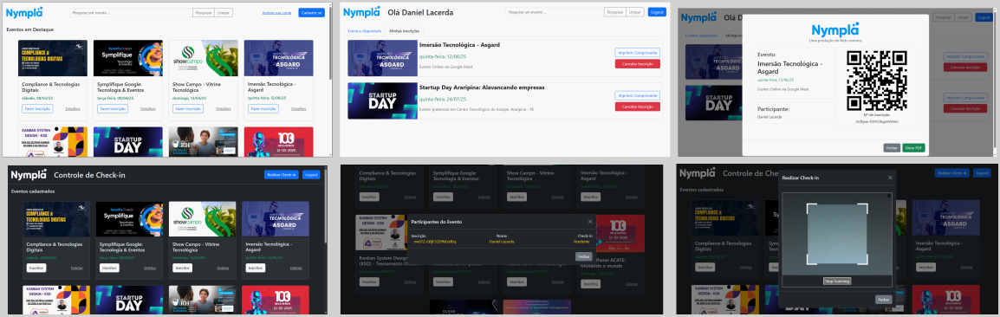

# Projeto Nympla

O projeto consiste em um sistema de gerenciamento de eventos e usuários semelhante ao site Sympla. O sistema irá possibilitar a inscrição em eventos, cadastro e login de usuários, autenticação e autorização, geração de comprovantes de inscrição, check-in de usuários, entre outras funcionalidades.

# Design

Sugestão de design das principais telas do projeto.

# Dev Log

**Aula 02 - 18/03 (terça)**

- [x] Criação das pastas **entities** e **services**
  - [x] Criação do User.js
  - [x] Criação do UserService.js
  - [x] Atualização do UserControler.js

**Aula 01 - 17/03 (segunda)**

- [x] Definição da estrutura do projeto e download das dependências **express** e **pg**
  - [x] Criação do Server.js
  - [x] Criação do Routes.js
  - [x] Criação do UserControler.js
